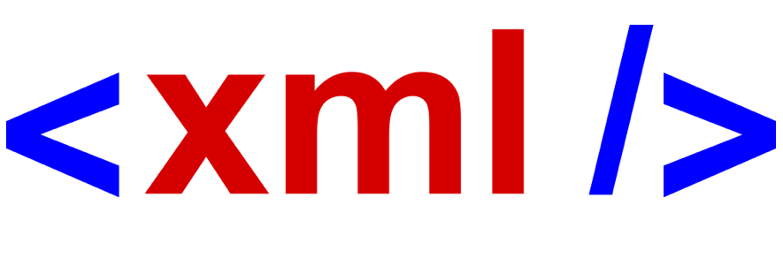

<!-- Begin README -->

    <a href="https://github.com/scottgriv/uwp-audio_recorder" target="_blank">
        <picture>
            <source media="(prefers-color-scheme: dark)" srcset="./docs/images/icon-dark.png">
            <source media="(prefers-color-scheme: light)" srcset="./docs/images/icon-light.png">
            
        </picture>
    </a>

 

    
    
    
     
    
    
    
     
    

---------------

<h1 align="center">JSON/XML/YAML Portfolio Template</h1>

This project contains a document that serves as a **Portfolio Template** in `JSON`, `XML`, and `YAML` formats. The documents provide structured information about one's background, title, location, and various online profiles. Feel free to edit it and expand upon it as you see fit. 

---------------

## Table of Contents

- [Background Story](#background-story)
- [Definitions](#definitions)
- [Getting Started](#getting-started)
    - [JSON](#json-javascript-object-notation)
    - [XML](#xml-extensible-markup-language)
    - [YAML](#yaml-yaml-aint-markup-language)
- [Closing](#closing)
- [Resources](#resources)
- [License](#license)
- [Credits](#credits)

## Background Story

I created this project to format my portfolio in `JSON`, `XML`, and `YAML` formats. I wanted to create a portfolio that could be used for various purposes, including configuration files, data exchange between systems, APIs, and more. 

## Definitions

`JSON`, `XML`, and `YAML` are all data serialization formats used to structure and represent data in a standardized way. They are commonly used for various purposes, including configuration files, data exchange (interchanges) between systems, APIs, and more. Here's how each format is used:

## Getting Started

Use the following files as a template for your portfolio:
- [JSON](portfolio.json)
- [XML](portfolio.xml)
- [YAML](portfolio.yaml)

### JSON (JavaScript Object Notation):

    

 

- `JSON` is a lightweight data-interchange format that uses a syntax similar to JavaScript object literals. It consists of key-value pairs, arrays, and nested objects.
- `JSON` is commonly used for transmitting data between a server and a web application. It's easy for humans to read and write, and it's easy for machines to parse and generate.
- `JSON` has become the de facto standard for data exchange in modern web applications, APIs (e.g., RESTful APIs), and configuration files.

### XML (eXtensible Markup Language):

    

- `XML` is a markup language that uses a structured format to represent data. It consists of a set of tags that define elements and their relationships.
- `XML` is widely used for representing structured data in a human-readable and machine-readable format. It's used for configuration files, data exchange, document storage, and more.
- Applications use `XML` parsers to read and manipulate `XML` data. Common use cases include RSS feeds, configuration files (e.g., web application configuration), and document formats (e.g., Microsoft Office Open `XML`).

### YAML (YAML Ain't Markup Language):

    

 

`YAML` is a human-readable data serialization format that uses indentation to represent data structures. It's often used for configuration files and data exchange.
`YAML` is less verbose compared to `XML` and `JSON`, making it well-suited for configuration files where readability is important.
It's commonly used in configuration files for software projects, continuous integration tools, and infrastructure as code tools like Ansible.

## Closing

In summary, `JSON`, `XML`, and `YAML` are used for structuring and representing data in various applications and contexts. The choice of format depends on factors such as the use case, the technologies involved, and the preference for readability and ease of use.

> [!NOTE] 
> I will be adding more details to the documents over time such as skills, experience, education, certifications, etc.
> Feel free to fork this repo and enter a pull request if you'd like to contribute!
> If you decide to enter a pull request with additional details, please make sure to update all three documents.

> [!TIP] 
> For an open-sourced portfolio website template, I'd suggest you checking out my repo [here](https://github.com/scottgriv/portfolio-website), which looks like [this](https://www.scottgrivner.dev). Feel free to fork it and use it as you see fit!

**Happy Coding! 🚀**

## Resources

- [JSON](https://www.json.org/json-en.html)
- [XML](https://www.w3.org/XML/)
- [YAML](https://yaml.org/)
- [XML vs JSON](https://www.diffen.com/difference/JSON_vs_XML)

## License

This project is released under the terms of **The Unlicense**, which allows you to use, modify, and distribute the code as you see fit. 
- [The Unlicense](https://choosealicense.com/licenses/unlicense/) removes traditional copyright restrictions, giving you the freedom to use the code in any way you choose.
- For more details, see the [LICENSE](LICENSE) file in this repository.

## Credits

**Author:** [Scott Grivner](https://github.com/scottgriv)  
**Email:** [scott.grivner@gmail.com](mailto:scott.grivner@gmail.com)  
**Website:** [scottgrivner.dev](https://www.scottgrivner.dev)  
**Reference:** [Main Branch](https://github.com/scottgriv/json-xml-yaml-based_portfolio)  

---------------

    

<!-- End README -->
